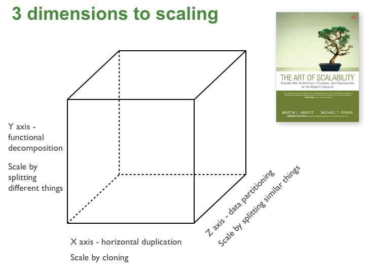

# Multi-node Design Pattern

Multi-node patterns describe solutions using services (containers) spread across multiple machines.

Examples of addressed problems: scalability, reliability, redundancy, separation of concerns.

The containers:
- are loosely coupled
- don't share local resources
- can't communicate directly, but over the network

## Goals

The following patterns have different goals. Here is a summary:

| Name of the Pattern  | Main/Direct Goal                                                | Benefits                               |
| -------------------- | --------------------------------------------------------------- | -------------------------------------- |
| Replicated Services  | Increase the number of requests per second the system can manage | reliability, redundancy, and scaling   |
| Sharded Services     | Increase the amount of data the system can manage               | scale in response to the data size     |
| Scatter/Gather       | Reduce the response time of the system                          | reduce response time of the system     |

# Scalability

The book, The Art of Scalability, describes a useful model based on three dimensions:

Image from: https://microservices.io/articles/scalecube.html