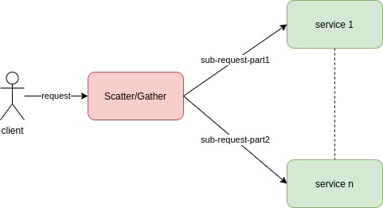

#  Scatter/Gather

Many services work in parallel to respond to the same request.

Each request is split in multiple requests to be served in parallel: in that way complex requests can be served by many services working in parallel.

A load balancing node, also called *Scatter/Gather*, must be able to split the request and aggregate results.

