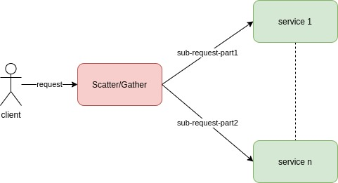

# Scatter/Gather

The services work in parallel to respond to the same request.

Each request is split into multiple requests to be served in parallel: complex requests can be served by multiple services working in parallel.

A load balancing node, also called *Scatter/Gather*, must be able to split the request and aggregate results.

