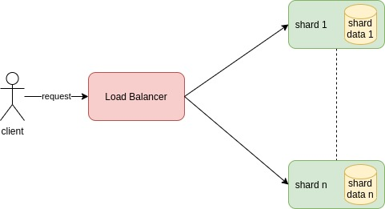

#  Sharded Services

Each service, called *shard*, can serve only a subset of the possible requests.
A load balancing node, also called *shard manager*, must be able to distribute the request to the right shard.

This type of replication is used to scale a service based on the size of the state needed by the service.
In other words, it's useful when data to be managed is too much to be handled by a single service.

