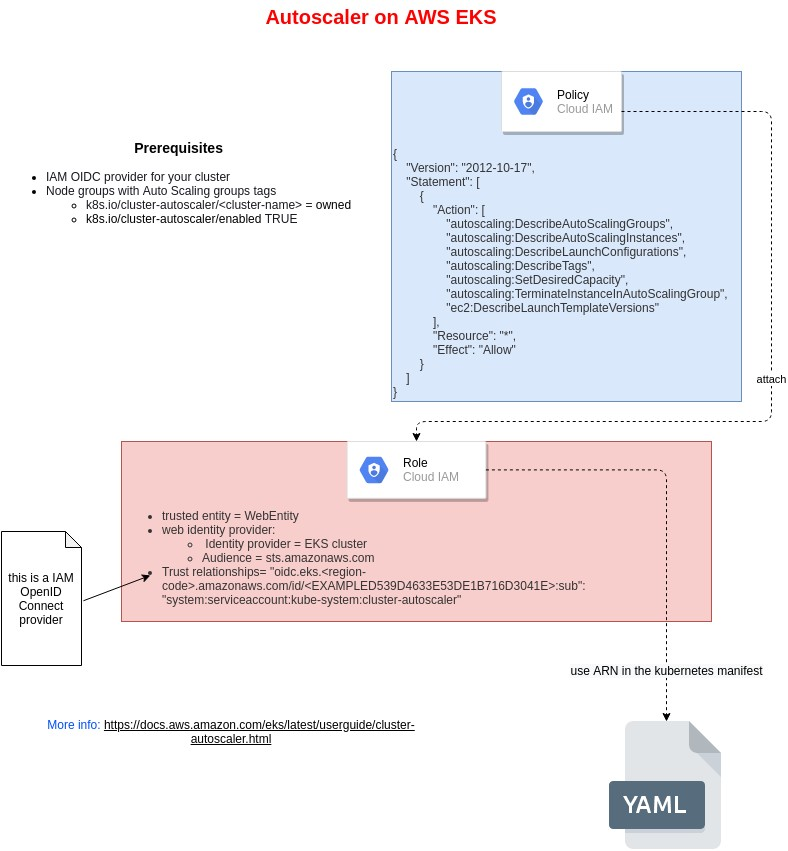

# Cluster Autoscaler

a rapid how-to schema to install and configureautoscaler on AWS / EKS
## AWS configuration schema



## Review of some detail from the previous schema

**Prerequisites**

- IAM OIDC provider for t cluster

- Node groups with Auto Scaling groups tags

- - k8s.io/cluster-autoscaler/<cluster-name> = owned
  - k8s.io/cluster-autoscaler/enabled TRUE


**Policy:**

```json
{
    "Version": "2012-10-17",
    "Statement": [
        {
            "Action": [
                "autoscaling:DescribeAutoScalingGroups",
                "autoscaling:DescribeAutoScalingInstances",
                "autoscaling:DescribeLaunchConfigurations",
                "autoscaling:DescribeTags",
                "autoscaling:SetDesiredCapacity",
                "autoscaling:TerminateInstanceInAutoScalingGroup",
                "ec2:DescribeLaunchTemplateVersions"
            ],
            "Resource": "*",
            "Effect": "Allow"
        }
    ]
}
```

**Trusted Relationship example:**
```json
{
  "Version": "2012-10-17",
  "Statement": [
    {
      "Effect": "Allow",
      "Principal": {
        "Federated": "arn:aws:iam::123456123456:oidc-provider/oidc.eks.<region>.amazonaws.com/id/<code>"
      },
      "Action": "sts:AssumeRoleWithWebIdentity",
      "Condition": {
        "StringEquals": {
          "oidc.eks.<region>.amazonaws.com/id/<code>:sub": "system:serviceaccount:kube-system:cluster-autoscaler"
        }
      }
    }
  ]
}
```


## Kubernetes Manifest

The ARN role can now be used in the Service Account for the autoscaler (that need to be installed in the cluster).