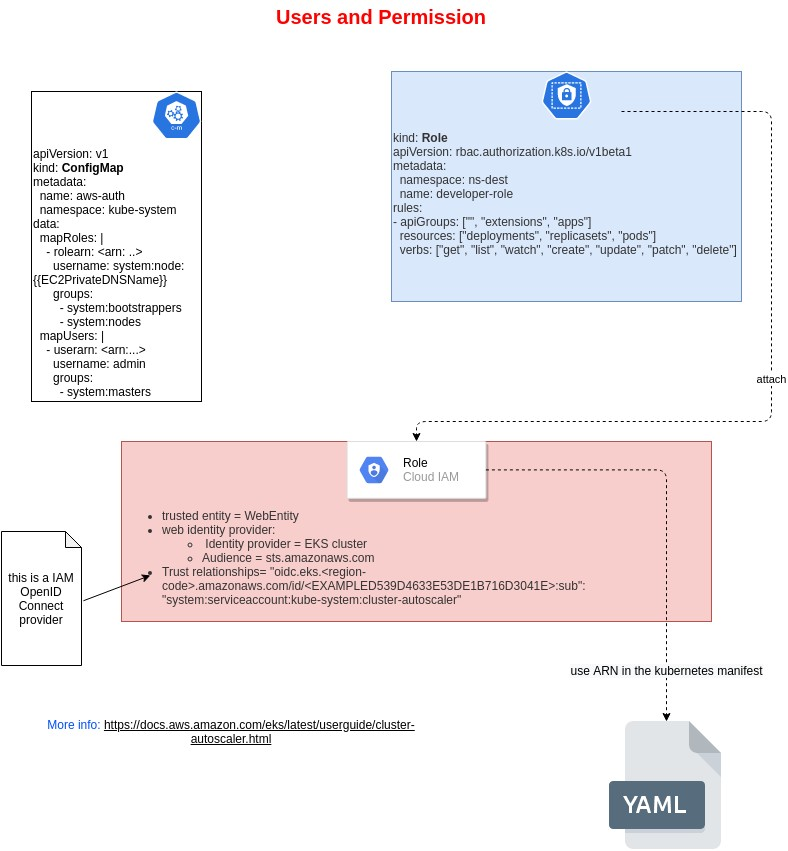
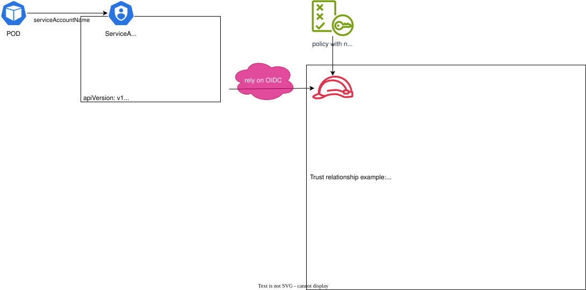

# EKS API Access Management


EKS supports two **type of identities**:
- AWS **IAM Principal** (role or user - it can come from IAM or a Federated Identity):
	- this type lets you assign permissions to work with
		- K8S API or
		- EKS API
	- This leverages the IAM Authenticator for K8S installed on the Control Plane
- **user from OIDC**
	- this type lets you assign permissions to work with
		- K8S API

Both types can be used as the same time


## AWS IAM Principal: associate k8s permissions

To associate K8S permissions to IAM Identities, 2 ways:
- **ConfigMap AWS-auth** (deprecated)
- **Access Entries** (the current recommended way)

You can activate both or only one:

`aws eks update-cluster-config --name my-cluster --access-config authenticationMode=`
- API_AND_CONFIG_MAP
- API
- CONFIG_MAP

### IAM Principal for EKS Cluster
When you create an EKS Cluster, the IAM principal that create the cluster is automatically granted `system:master` in the configuration of the control plane.
This principal doesn't appear in any configuration.
This behaviour changes with the Access Entries support.

### ConfigMap AWS-auth
The ConfigMap stored in the K8S let to link IAM users to RBAC permission.

To grant additional IAM identities the ability to interact with your Amazon EKS cluster, you can add the users or roles to the `aws-auth` ConfigMap

This will grant, for example, the IAM principals defined to connect using kubectl.

```yaml
apiVersion: v1
kind: ConfigMap
metadata:
  name: aws-auth
  namespace: kube-system
data:
  mapRoles: |
    - rolearn: <arn: ..>
      username: system:node:{{EC2PrivateDNSName}}
      groups:
        - system:bootstrappers
        - system:nodes
  mapUsers: |
    - userarn: <arn:...>
      username: admin
      groups:
        - system:masters

```


note on the **username**:
you should include {{SessionName}} in your username. That way, the audit log will record the session name so you can track who the actual user assume this role along with the CloudTrail log.

example:
```yaml
- rolearn: arn:aws:iam::XXXXXXXXXXXX:role/testRole
  username: testRole:{{SessionName}}
  groups:
    - system:masters
```

###  Access Entries

Access Entries, the current recommended method, is supported since:

|Kubernetes version|Platform version|
|---|---|
|`1.28`|`eks.6`|
|`1.27`|`eks.10`|
|`1.26`|`eks.11`|
|`1.25`|`eks.12`|
|`1.24`|`eks.15`|
|`1.23`|`eks.17`|

you can check your version with the command: `aws eks describe-cluster --name `my-cluster` --query 'cluster.{"Kubernetes Version": version, "Platform Version": platformVersion}'`


After you activate Access Entries:

`aws eks update-cluster-config --name my-cluster --access-config authenticationMode=API_AND_CONFIG_MAP or API`

**you can create access entries**. They are composed by:
- ARN (role or user)
- Type
	- EC2 Linux (IAM used with linux)
	- EC2 Windows (IAM used for self manages windows hosts)
	- FARGATE_LINUX (IAM used with fargate)
	- STANDARD (default)

**TYPES:**
If the access entry is for an IAM role that is assumed by a self-managed EC2 node, select the appropriate node type. Otherwise select Standard. It's not necessary to create access entries for managed nodes or Fargate profiles.

For the **non `STANDARD`** types:
- username is set by EKS
- EKS automatically grants permissions required to function properly in your cluster.

For the **`STANDARD`** types:
- you can specify a username
- you can assign:
	- one or more Access Policies (these are K8S permission, not IAM permission)
	- a k8s group - RBAC


**Access policies** include `rules` that contain Kubernetes `verbs` (permissions) and `resources`. Access policies don't include IAM permissions or resources. Similar to Kubernetes `Role` and `ClusterRole` objects, access policies only include `allow` `rules`.

More on the available access policies: https://docs.aws.amazon.com/eks/latest/userguide/access-policies.html


## Add IAM principals to service accounts




# EKS Workload Access Management

## IAM roles for service accounts

