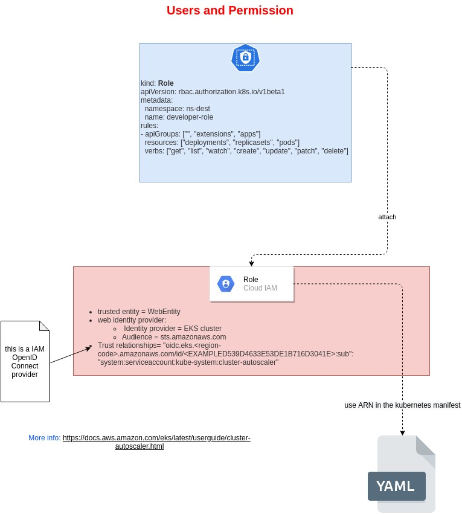

# Add User to EKS


## Add User to che cluster:
Use the config map aws-auth:

```yaml
apiVersion: v1
kind: ConfigMap
metadata:
  name: aws-auth
  namespace: kube-system
data:
  mapRoles: |
    - rolearn: <arn: ..>
      username: system:node:{{EC2PrivateDNSName}}
      groups:
        - system:bootstrappers
        - system:nodes
  mapUsers: |
    - userarn: <arn:...>
      username: admin
      groups:
        - system:masters

```

## Add permission

You can use predefined roles or create specific roles.


## Schema


