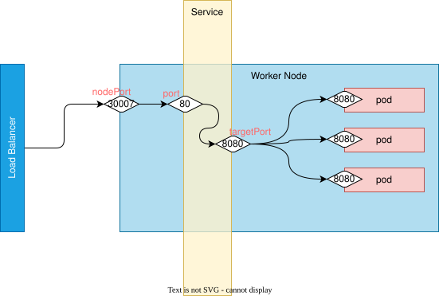

# Network


## Summary of services (kubernetes object) types

| Services Type                | description                                                                                                                    | manifest                 |
| ---------------------------- | ------------------------------------------------------------------------------------------------------------------------------ | ------------------------ |
| ClusterIP                    | bind service on a IP in the cluster                                                                                            | spec.type = ClusterIP    |
| NodePort                     | bind service on a port on every node in the cluster                                                                            | spec.type = NodePort     |
| LoadBalancer                 | use a Provider LB                                                                                                              | spec.type = LoadBalancer |
| ExternalName                 | CNAME to a DNS                                                                                                                 | spec.type = ExternalName |
| Headless                     | No virtual cluster IP; no LB; no proxy                                                                                         | spec.clusterIP = None    |
| Headless -> with selector    | endpoint are automatically created<br />it returns a DNS Record A                                                              | clusterIP = None         |
| Headless -> without selector | endpoint are NOT automatically created<br />it returns a DNS Record A or CNAME<br />the endpoint can contain multiple IP => LB |                          |

Note: for application layer (layer 7) routing, you need to use Ingress (k8s object)


## Cluster Networking

There are 4 distinct networking problems to address:

- Highly-coupled container-to-container communications: this is solved by Pods and localhost communications.
- Pod-to-Pod communications: provided by a CNI plug-in
  - Kubernetes imposes the following fundamental requirements on any networking implementation:
    - pods can communicate with all other pods on any other node without NAT
    - agents on a node (e.g. system daemons, kubelet) can communicate with all pods on that node
- Pod-to-Service communications: this is covered by services
- External-to-Service communications: this is covered by services.

### IP Address Management

Considering:

- each pod needs an IP (uniquely addressable)
- IPs can be internal to the cluster or externally routable
- pods are ephemeral

K8s needs IP allocation being quick and efficient. This management is referred as [IPAM](https://en.wikipedia.org/wiki/IP_address_management)

IPAM is implemented by a CNI plug-in.

When a cluster is created, a pod network [CIDR](https://en.wikipedia.org/wiki/Classless_Inter-Domain_Routing) must be specified: `kubeadm init --pod-network-cidr 10.30.0.0/16` (k8s will allocate a chunk of this cluster-cidr to every node and this behaviour can be controlled by `--node-cidr-mask-size-ipv4` of `--node-cidr-mask-size-ipv6` flags)

These setting are then used by the CNI plug-in (they could also not use them)

### Routing Protocols

Border Gateway Protocol (BGP) is commonly used (ex as Calico and Kube-Router)

For Calico, as example, a BGP daemon is run as part of the Calico Pod, on every host. As new routes are known, the Calico Pod modifies the kernel routing table.

### Encapsulation and Tunneling

Routing protocols may not be able to integrate with an underlying network (ex cloud-provider’s networks). This is when is suitable to use Encapsulation and Tunneling.

Tunneling protocols: as VXLAN (one of the most used), Geneve, and GRE: they provide a virtualized layer-2 network, often referred to as an overlay network.

Downsides:

- harder to understand and troubleshoot
- processing cost
- packets will be larger

### Traffic Encryption

Pod-to-Pod traffic not encrypted by default.

Some network plug-ins support encrypting traffic over the wire (Antrea with IPsec; Calico by using WireGuard)


## Services - kubernetes object

With services you can reach any node in the cluster. They provide a distrubuted load balancer for Pods.

"The Service API is an abstraction to help you expose groups of Pods over a network. Each Service object defines a logical set of endpoints (usually these endpoints are Pods) along with a policy about how to make those pods accessible."

Cluster IPs are stable virtual IPs that load-balance traffic across all of the endpoints in a service. Behind the scene, this is managed by kube-proxy.

You can use selector-less services to manually assigned **IPs outside** the cluster.

### Endpoints

Endpoints represent a target where the Pods can be reached. We can see a list of Endpoints, which take on the same name of the Service, by typing the command `kubect get ep`.

### Example of service

```yaml


apiVersion: v1
kind: Service
metadata:
  name: servicename
spec:
  ports:
  - port: <externalport>
    protocol: TCP
    targetPort: <internalport>
  selector:
    app: <selector-for-pods>
  type: LoadBalancer|ClusterIP|NodePort|ExternalName
  [clusterIP: None]

```

Note: selector-for-pods need to link the service with pods.

### NodePort Example


```yaml
apiVersion: v1
kind: Service
metadata:
  name: my-service
spec:
  type: NodePort
  selector:
    app.kubernetes.io/name: MyApp
  ports:
    - port: 80
      # By default and for convenience, the `targetPort` is set to
      # the same value as the `port` field.
      targetPort: 8080
      # Optional field
      # By default and for convenience, the Kubernetes control plane
      # will allocate a port from a range (default: 30000-32767)
      nodePort: 30007
```





### Types

- **ClusterIP**: service is exposed on an cluster internal IP
- **NodePort**: service is exposed on a port on each node
- **LoadBalancer**: use the load balancer provided by the cloud provider
- **ExternalName**: return a CNAME

**ClusterIP** Services are designed to make Pods internally available within the cluster only, whereas **NodePort**- and **LoadBalancer**-type Services are designed to expose a port and create outside access to the cluster.

The available port **range** for a **NodePort** Service is 30000–32768


### External DNS

the following service, of type ExternalName, let to create a service (so an IP in the cluster is created) populated with an CNAME record (instead of a A record as for the other types) that point to the external name spacified.

```yaml
kind: Service
apiVersion: v1
metadata:
  name: external-service
spec:
  type: ExternalName
  externalName: address-external-service.com

```

Such a strategy let to create a service to map a internal/external resource that can change (without internal impacts)


### Headless Services

It is possible to bypass the Service altogether and **go directly to the Pod (or potentially to external service** in case of services without selector).
There is no **load-balancing**

"headless" services are created by explicitly specifying "None" for the cluster IP (.spec.clusterIP).

“headless” === it doesn’t have a cluster virtual IP address

kube-proxy does not handle these Services, and there is no load balancing or proxying done by the platform for them.

This type of service removes the IP address from the Service: **the DNS provide communication  directly to the Pod.**

Use case example: a database cluster, where only one of the database copies is responsible for writing to the database, and all others are only allowed to read.
#### With selectors

- endpoints are automatically created
- DNS return A records pointing directly to the pods

example:

```yaml
apiVersion: v1
kind: Service
metadata:
  name: my-headless-service
spec:
  clusterIP: None
  selector:
    app: my-app
    # defines which pods the service will target. Here, it selects pods with the label `app: my-app`
  ports:
    - protocol: TCP
      port: 80
      targetPort: 8080
```

#### Without selectors

- endpoints are not automatically created
- DNS return:
  - CNAME for ExternalName services
  - a record for any endpoint

```yaml

apiVersion: v1
kind: Service
metadata:
  name: external-service
spec:
  clusterIP: None
  ports:
    - port: 80


---


apiVersion: discovery.k8s.io/v1
kind: EndpointSlice
metadata:
  name: external-service-1
  labels:
    kubernetes.io/service-name: external-service
addressType: IPv4
ports:
  - port: 80
endpoints:
  - addresses:
    - "10.1.2.3"


```

#### Example: Point to external IP

In the case you have only a IP for an external service, you need a A record:

1. create a service without selector and without the external name: kubernetes will allocate a virtual IP and an A record, but no endpoint will be populated.

```yaml
kind: Service
apiVersion: v1
metadata:
  name: external-ip-service
spec:
  clusterIP: None

```

2. create manually the endpoint

```yaml
kind: Endpoints
apiVersion: v1
metadata:
  name: external-ip-service
subsets:
  - addresses:
    - ip: 192.168.0.180
    ports:
    - port: 3306
```

The addresses can be multiple (load balancing)


### Note on external services

external services don't use health checks

### in short

- provide direct connection to pod or external services
- no load balancing

With selectors:
- they target pods using labels
- endpoints automatically created
- DNS return an A record pointing to the pod

With selectors:
- no selector
- endpoints NOT created ⇒ manual creation
- DNS return an A (for endpoint) or ExternalName (for external services)


## Services vs Ingresses

Service operate at Layer 4 of the OSI model: they forward TCP and UDP without analyzing the traffic.

Ingresses operate at Layer 7 of the OSI model: they analyzing the traffic and they let to implement other features like virtual hosting.


## Ingress - kubernetes object

Ingress is a Kubernetes-native way to implement the “virtual hosting” pattern.

Ingresses implementation are not available on vanille k8s: you need to install one.

The ingresses are merged in a unique configuration managed by the ingress controller but there is no “standard” Ingress controller built into Kubernetes: a controller must be installed from one of many optional implementations.

If you specify duplicate or conflicting configurations, the behavior is undefined.

The intersection of Ingress and Service Meshes is not clear.

Kubectl imperative command for ingresses is very limitated.

### Ingress and Namespaces

An Ingress object can only refer to an upstream service in the same namespace.
But multiple Ingress objects in different namespaces can specify subpaths for the same host. These Ingress objects are then merged together to a unique final config for the Ingress controller.

A global coordination is needed.

### Serving TLS
Users need to specify a secret with their TLS certificate and keys.
Example:

```yaml
apiVersion: v1
kind: Secret
metadata:
  creationTimestamp: null
  name: tls-secret-name
type: kubernetes.io/tls
data:
  tls.crt: <base64 encoded certificate>
  tls.key: <base64 encoded private key>

---

apiVersion: extensions/v1beta1
kind: Ingress
metadata:
  name: tls-ingress
spec:
  tls:
  - hosts:
    - example.com
    secretName: tls-secret-name
  rules:
  - host: example.com
    http:
      paths:
      - backend:
          serviceName: test
          servicePort: 8080

```

To reduce complexity:

- https://letsencrypt.org/
  (you can set up Kubernetes to automatically fetches and installs TLS certificates)
- https://github.com/jetstack/cert-manager

### Path Types
There are three path types:
- `Exact` : it has to match the path exactly (case-sensitive) for the path to be valid (e.g., `hello.com/app`).
- `Prefix`: it matches the URL path split by a forward slash (`/`), where the characters between the slash are the element’s prefix
- `ImplementationSpecific` it leaves it up to the `Ingress` class to decide a prefix or an exact path type.
### Examples

Base ingress forwarding everything to a service:

```yaml
apiVersion: extensions/v1beta1
kind: Ingress
metadata:
  name: simple-ingress
spec:
  backend:
    serviceName: test
    servicePort: 8080
```

Example with hostname:

```yaml
apiVersion: extensions/v1beta1
kind: Ingress
metadata:
  name: host-ingress
spec:
  rules:
  - host: example.com
    http:
      paths:
      - backend:
          serviceName: test
          servicePort: 8080

```

Example with path (the longest prefix wins):

```yaml
apiVersion: extensions/v1beta1
kind: Ingress
metadata:
  name: path-ingress
spec:
  rules:
  - host: example.com
    http:
      paths:
      - path: "/a"
        backend:
          serviceName: service1
          servicePort: 8080
      - path: "/b/"
        backend:
          serviceName: service2
          servicePort: 8080

```

The path remains unmodified to the upstream service => the upstream service needs to be ready to serve traffic on that subpath.


### Annotation and advanced features

Path Rewriting is supported only by some Ingress controller implementations.

Many feature are activated by annotation. To scope annotation, you can used different ingresses

The annotation `kubernetes.io/ingress.class` is used to specify the ingress controller used by the ingress: this is particularly useful in the case of multiple ingress controllers are installed. if it is missing, behavior is undefined.


### default-http-backend

Fallback for requests not matching the specified rules.

Convention not universally supported.

### Ingress Controllers

- Contour: a controller built to configure the open source (and CNCF project) load balancer called Envoy
- ingress-nginx: https://github.com/kubernetes/ingress-nginx/
- Emissary-Ingress: an open-source Kubernetes-native API Gateway + Layer 7 load balancer + Kubernetes Ingress built on Envoy Proxy (https://github.com/emissary-ingress/emissary)
- Gloo Edge: a feature-rich, Kubernetes-native ingress controller, and next-generation API gateway
- Traefik: a reverse proxy that can function as an Ingress controller


## DNS

### CoreDNS

The **coredns** is the default DNS service in k8s (it could be replaced): it provides DNS names for cluster IPs
It is itself managed by k8s (a great example of Kubernetes building on Kubernetes).
Its IP is exposed by the service kube-adm and it should match the content of the /etc/resolv.conf. Every pod can use it as DNS resolver.

### Cluster FQDN

Here a list of fully qualified domain name (FQDN) for k8s objects.

**Pods**

*' ip separated by hyphen' . namespace . pod . cluster . local*

ex: 10.1.1.1.default.pods.cluster.local

**Service:**

*service_name.namespace.scv.cluster.local*

Inside a namespace you can use just the name of the service

**Services pointing to stafefulset**:

*service_name.namespace.scv.cluster.local*

and besides:

*service_name-1.service_name.namespace.scv.cluster.local*
...
*service_name-N.service_name.namespace.scv.cluster.local*


Note : The `Corefile` defines a cluster domain, by  default *cluster . local*
Adding `cluster.local` is optional.

### Cluster DNSs

A Pod can resolve the Service by hostname if both objects live in the same namespace.

From a different namespace: `service_name.namespace`

CoreDNS provides the configuration option `pods insecure` in the `Corefile` file to create DNS records for Pods.
In this case, pod to pod communication in the same namespace: a Pod with the IP address `10.0.0.85` has a corresponding DNS record with `10-0-0-85`.


### Kubelet and coreDNS

Kubelet is responsible for creating the CoreDNS Pod and injecting the configuration into that Pod: this i made by though the file **/var/lib/kubelet/config.yaml**.
This configuration is just for the kubelet, and will include the authentication for the kubelet, the health Endpoints, the cluster DNS.


## Network Policy

Network Policies let to define what ingress and egress traffic is allowed.

https://kubernetes.io/docs/concepts/services-networking/network-policies/

NP are not implemented by kubernets itself: CNI plug'in must provide them and if the installed CNI Plug-in doen't support it, NP are not applied.

NP are **Namespace-scoped**: by default (NetworkPolicy not present), Kubernetes allows all communication to and from workloads: when applying a NP, the default behavior inverts and any egress and ingress traffic not allowed by the policy will be blocked.


Features not supported by NP:

- Complex condition evaluation
- Resolution of IPs based on DNS records
- L7 rules (host, path, etc.)
- Cluster-wide policy

Some CNI plug-ins provide their own policies letting to satisfy these limitations.


### Example:

Context:
- 1 pod in namespace 'ns1'
- 1 pod in namespace 'ns2'
- 1 server in namespace 'ns-server'


```yaml
apiVersion: v1
kind: Namespace
metadata:
  name: ns1
  labels:
    name: ns1
---
apiVersion: v1
kind: Namespace
metadata:
  name: ns2
  labels:
    name: ns2
---
apiVersion: v1
kind: Namespace
metadata:
  name: ns-server
  labels:
    name: ns-server
---
apiVersion: apps/v1
kind: Deployment
metadata:
  labels:
    app: server
  name: server
  namespace: ns-server
spec:
  replicas: 1
  selector:
    matchLabels:
      app: server
  template:
    metadata:
      labels:
        app: server
    spec:
      containers:
      - image: nginx
        name: nginx
---
apiVersion: v1
kind: Pod
metadata:
  labels:
    run: pod1
  name: pod1
  namespace: ns1
spec:
  containers:
  - args:
    - sh
    - -c
    - sleep 1d
    image: alpine
    name: pod1
---
apiVersion: v1
kind: Pod
metadata:
  labels:
    run: pod1
  name: pod1
  namespace: ns2
spec:
  containers:
  - args:
    - sh
    - -c
    - sleep 1d
    image: alpine
    name: pod1
---
apiVersion: v1
kind: Service
metadata:
  labels:
    app: server
  name: server
  namespace: ns-server
spec:
  ports:
  - port: 80
    protocol: TCP
    targetPort: 80
  selector:
    app: server
  type: ClusterIP

```

Network policy enabling only pod from namespace ns1 to connect to server in namespace ns-server:

```yaml
apiVersion: networking.k8s.io/v1
kind: NetworkPolicy
metadata:
  name: test-network-policy
  namespace: ns-server
spec:
  podSelector: {}
  policyTypes:
  - Ingress
  ingress:
  - from:
    - namespaceSelector:
        matchLabels:
          name: ns1

```


## Container Networking Interface (CNI)

https://github.com/containernetworking/cni

The CNI specification defines a few key operations:

- ADD: adds a container to the network
- DELETE: removes a container from the network and releases all associated resources
- CHECK: verifies a container’s network
- VERSION: return the CNI version(s) supported by the plug-in.
