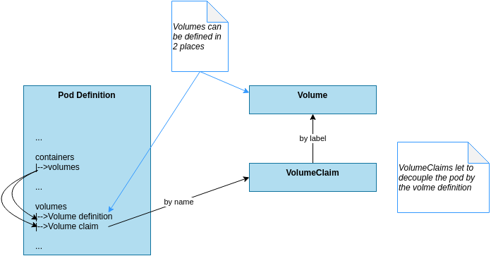

# Storage

## Basic Usage

To add a volume to a pod:

- add spec.volumes: this is an array of all the volumes that may be accessible by the containers
- add volume mounts in the container definition: this define how to mount one or more volume from previously declared volumes

## Strategies and volume types

**Non-persistent data:**

this can be used for communication, synchonization or caching.
 `emptyDir` volume type let to define such type of volume

**Persistent data:**

this type of data is independent of the lifespan of pods and should be accessible independently by the nodes on which the pods are instantiate on.
K8s support a widely range of remote networking protocols  (ex NFS) or cloud storage

**Host filesystem:**

in some case application could need to access the filesystem of the node (example to access to /dev).
`hostPath` volume is the solution.


## Volume definitions and utilization





## Example with Volume defined in the pod specs

```yaml
apiVersion: v1
kind: Pod
metadata:
  name: test
spec:
  volumes:
    - name: "volume-data"
      nfs:
        server: my.nfs.server.local
        path: "/exports"
  containers:
    - image: some_image
      name: name
      ...
      volumeMounts:
        - mountPath: "/data"
          name: "volume-data"

```


## Example with PersistentVolumeClaim

Volume object

```yaml
apiVersion: v1
kind: PersistentVolume
metadata:
  name: storage_for_smt
  labels:
    volume: volume-example
spec:
  accessModes:
  - ReadWriteMany
  capacity:
    storage: 1Gi
  nfs:
    server: 192.168.0.1
    path: "/exports"
```


Volume Claim Object

```yaml
kind: PersistentVolumeClaim
apiVersion: v1
metadata:
  name: storage_for_smt
spec:
  accessModes:
  - ReadWriteMany
  resources:
    requests:
      storage: 1Gi
  selector:
    matchLabels:
    # this label it used to link it to the PersistentVolume
      volume: volume-example
```

The label `volume-example` let to link together these 2 objects


Pod using the volume claim.

```yaml
apiVersion: extensions/v1
kind: ReplicaSet
metadata:
 ...
spec:
 ...
  template:
  ...
    spec:
      containers:
      - name: database
      ...
        volumeMounts:
          - name: storage_for_db
            mountPath: "/var/lib/mysql"
      volumes:
      - name: storage_for_db
        persistentVolumeClaim:
          claimName: storage_for_smt
```


## Dynamic Volume Provisioning

A cluster can support dynamic volume provisioning: the cluster operator creates one or more StorageClass objects like the following

```yaml
apiVersion: storage.k8s.io/v1
kind: StorageClass
metadata:
  name: default
  annotations:
    storageclass.beta.kubernetes.io/is-default-class: "true"
  labels:
    kubernetes.io/cluster-service: "true"
provisioner: kubernetes.io/azure-disk
```

and it can be referenced as storage class in a persistent volume claim.

The dynamic provisioner, triggered by a storage claim, will create an appropriate volume.

Example of Volume claim:

```yaml
kind: PersistentVolumeClaim
apiVersion: v1
metadata:
  name: my-claim
  annotations:
    volume.beta.kubernetes.io/storage-class: default
spec:
  accessModes:
  - ReadWriteOnce
  resources:
    requests:
      storage: 10Gi
```


### Reclaim Policy

PersistentVolumes that are dynamically created by a StorageClass will have the reclaim policy specified in the `reclaimPolicy` field of the class, which can be either `Delete` or `Retain`.

default is `Delete`, this means that the lifespan of the persistent volumes is the same of the pod that creates the volume: the volume will be destroyed after usage.

```yaml
apiVersion: storage.k8s.io/v1
kind: StorageClass
metadata:
  name: standard
provisioner: kubernetes.io/aws-ebs
parameters:
  type: gp2
reclaimPolicy: Retain # see here
allowVolumeExpansion: true
mountOptions:
  - debug
volumeBindingMode: Immediate
```


## Persistent volume claim template

When un object create more than one Pod and you want each pod having its own volume, you need a `persistent volume claim template`: it's the same mechanism for pod templates specified in a deployment.

```yaml
  volumeClaimTemplates:
  - metadata:
      name: database
      annotations:
        volume.alpha.kubernetes.io/storage-class: some stogare class
    spec:
      accessModes: [ "ReadWriteOnce" ]
      resources:
        requests:
          storage: 100Gi
```

This will create a Volume claim for each pod and it's really useful in statefulset.
