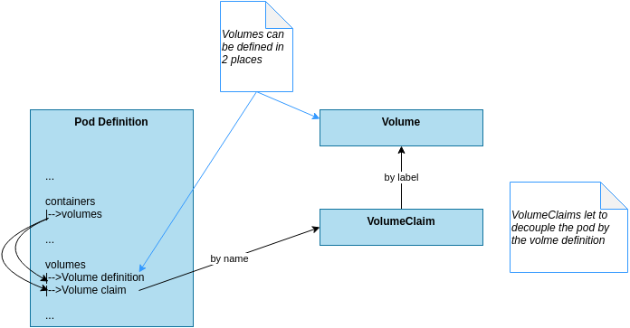

# Storage

## Intro
A volume is a Kubernetes capability that persists data beyond a Pod restart.

## Basic Usage Description

To add a volume to a pod:

1. add spec.volumes: this is an array of all the volumes that may be accessible by the containers
2. add volume mounts in the container definition: this define how to mount one or more volume from previously declared volumes

## Strategies and volume types

**Non-persistent (ephemeral) Volumes:**
this type can be used for communication, synchonization or caching.

Ephemeral volumes type supported:
- [emptyDir](https://kubernetes.io/docs/concepts/storage/volumes/#emptydir): empty at Pod startup, with storage coming locally from the kubelet base directory (usually the root disk) or RAM
- [configMap](https://kubernetes.io/docs/concepts/storage/volumes/#configmap), [downwardAPI](https://kubernetes.io/docs/concepts/storage/volumes/#downwardapi), [secret](https://kubernetes.io/docs/concepts/storage/volumes/#secret): inject different kinds of Kubernetes data into a Pod
- [CSI ephemeral volumes](https://kubernetes.io/docs/concepts/storage/ephemeral-volumes/#csi-ephemeral-volumes): similar to the previous volume kinds, but provided by special [CSI](https://kubernetes.io/docs/concepts/storage/volumes/#csi) drivers which specifically [support this feature](https://kubernetes-csi.github.io/docs/ephemeral-local-volumes.html)
- [generic ephemeral volumes](https://kubernetes.io/docs/concepts/storage/ephemeral-volumes/#generic-ephemeral-volumes), which can be provided by all storage drivers that also support persistent volumes

**Persistent Volumes:**
this type of storage is independent of the lifespan of pods and should be accessible independently by the nodes on which the pods are instantiate on.
K8s support a widely range of remote networking protocols  (ex NFS) or cloud storage services

Persistent Volume types are implemented as plugins. Kubernetes currently supports the following plugins:
- [`csi`](https://kubernetes.io/docs/concepts/storage/volumes/#csi) - Container Storage Interface (CSI)
- [`fc`](https://kubernetes.io/docs/concepts/storage/volumes/#fc) - Fibre Channel (FC) storage
- [`hostPath`](https://kubernetes.io/docs/concepts/storage/volumes/#hostpath) - HostPath volume (for single node testing only; WILL NOT WORK in a multi-node cluster; consider using `local` volume instead)
- [`iscsi`](https://kubernetes.io/docs/concepts/storage/volumes/#iscsi) - iSCSI (SCSI over IP) storage
- [`local`](https://kubernetes.io/docs/concepts/storage/volumes/#local) - local storage devices mounted on nodes.
- [`nfs`](https://kubernetes.io/docs/concepts/storage/volumes/#nfs) - Network File System (NFS) storage
Other types are deprecated or no more supported.

**Host filesystem:**

in some case application could need to access the filesystem of the node (example to access to /dev).
`hostPath` volume is the solution.


## Volume definitions and utilisation




Volumes can be defines in two ways:
- using the a volume object (PersistentVolume)
- defining it directly in the volumes fields


### Example with Volume defined in the pod specs

```yaml
apiVersion: v1
kind: Pod
metadata:
  name: test
spec:
  volumes:
    - name: "volume-data"
      nfs:
        server: my.nfs.server.local
        path: "/exports"
  containers:
    - image: some_image
      name: name
      ...
      volumeMounts:
        - mountPath: "/data"
          name: "volume-data"

```


### Example with PersistentVolumeClaim

Volume object

```yaml
apiVersion: v1
kind: PersistentVolume
metadata:
  name: storage_for_smt
  labels:
    volume: volume-example
spec:
  accessModes:
  - ReadWriteMany
  capacity:
    storage: 1Gi
  nfs:
    server: 192.168.0.1
    path: "/exports"
```


Volume Claim Object

```yaml
kind: PersistentVolumeClaim
apiVersion: v1
metadata:
  name: storage_for_smt
spec:
  accessModes:
  - ReadWriteMany
  resources:
    requests:
      storage: 1Gi
  selector:
    matchLabels:
    # this label it used to link it to the PersistentVolume
      volume: volume-example
```

The label `volume-example` let to link together these 2 objects


Pod using the volume claim.

```yaml
apiVersion: extensions/v1
kind: ReplicaSet
metadata:
 ...
spec:
 ...
  template:
  ...
    spec:
      containers:
      - name: database
      ...
        volumeMounts:
        - name: storage_for_db
          mountPath: "/var/lib/mysql"
      volumes:
      - name: storage_for_db
        persistentVolumeClaim:
          claimName: storage_for_smt
```


## Persistent volume claim template

When un object creates more than one Pod and you want each pod having its own volume, you need a `persistent volume claim template`: it's the same mechanism for pod templates specified in a deployment.

```yaml
  volumeClaimTemplates:
  - metadata:
      name: database
      annotations:
        volume.alpha.kubernetes.io/storage-class: some stogare class
    spec:
      accessModes: [ "ReadWriteOnce" ]
      resources:
        requests:
          storage: 100Gi
```

This will create a Volume claim for each pod and it's really useful in statefulset.


## Volume modes

Determines the type of storage being used: 

- `FileSystem`:
	- the storage will be presented as a file system
	- intended to be mounted into Pods as a directory
	- the default one
	- examples: emptyDir, hostPath, configMap, 
	
- `Block`:
	- block-level storage, such as a raw disk
	- backed by a block device, where the device is empty (unformatted)
	- intended for direct access by applications
	- not mounted as a file system
	- examples: Amazon Elastic Block Store (EBS), Azure Disk, iSCSI disks, FC (Fibre Channel) disks, CephFS, or even local disks


## Access Mode

Defines how a Persistent Volume (PV) can be mounted and accessed by pods:

| Access mode        | Short form | Description                                                                                                                                           |
| ------------------ | ---------- | ----------------------------------------------------------------------------------------------------------------------------------------------------- |
| `ReadWriteOnce`    | `RWO`      | only one node can mount the volume and read and write to it (it allows multiple pods to access the volume when the pods are running on the same node) |
| `ReadOnlyMany`     | `ROX`      | Multiple nodes can mount the volume for reading only.                                                                                                 |
| `ReadWriteMany`    | `RWX`      | Multiple nodes can mount the volume for writing and reading.                                                                                          |
| `ReadWriteOncePod` | `RWOP`     | Only one Pod on that one node can mount that volume for reading and writing.                                                                          |

Certain volumes only support certain access modes.

## Reclaim policies

A reclaim policy is for deciding what to do with the volume (a persistent volume of course) after it has been released of its claim.

- `Retain`:
	- it retains the data on the volume
	- the volume can be used again after a manual intervention (delete data, recreate the volume with the same data resources)
	- the default one 
	
- `Delete`:
	- indicates that the backed storage (i.e., Amazon EBS, Azure Disk) has been deleted as well as the PV object in Kubernetes

- `Recycle`:
	- performs a basic scrub (`rm -rf /thevolume/*`) on the volume and makes it available again for a new claim


## Dynamic Volume Provisioning

Dynamic Volume Provisioning in Kubernetes allows storage volumes to be created on-demand when persistent volume claims (PVCs) are made.

A cluster can support dynamic volume provisioning: the cluster administrator creates one or more StorageClass objects, like the following

```yaml
apiVersion: storage.k8s.io/v1
kind: StorageClass
metadata:
  name: default
  annotations:
    storageclass.beta.kubernetes.io/is-default-class: "true"
  labels:
    kubernetes.io/cluster-service: "true"
provisioner: kubernetes.io/azure-disk
```

and **it can be referenced as storage class in a persistent volume claim**.

The dynamic provisioner, triggered by a storage claim, will create an appropriate volume.

Example of Volume claim:

```yaml
kind: PersistentVolumeClaim
apiVersion: v1
metadata:
  name: my-claim
  annotations:
    volume.beta.kubernetes.io/storage-class: default
spec:
  accessModes:
  - ReadWriteOnce
  resources:
    requests:
      storage: 10Gi
```


### Reclaim Policy

PersistentVolumes that are dynamically created by a StorageClass will have the reclaim policy specified in the `reclaimPolicy` field of the class, which can be either `Delete` or `Retain`.

default is `Delete`, this means that the lifespan of the persistent volumes is the same of the pod that creates the volume: the volume will be destroyed after usage.

```yaml
apiVersion: storage.k8s.io/v1
kind: StorageClass
metadata:
  name: standard
provisioner: kubernetes.io/aws-ebs
parameters:
  type: gp2
reclaimPolicy: Retain # see here
allowVolumeExpansion: true
mountOptions:
  - debug
volumeBindingMode: Immediate
```


## PersistentVolume (PV) Phases

| Phase     | Description                                                                                                           |
| --------- | --------------------------------------------------------------------------------------------------------------------- |
| Available | The PV is ready to be claimed by a PersistentVolumeClaim (PVC). This is the initial state when a PV is first created. |
| Bound     | the volume is bound to a claim                                                                                        |
| Released  | the claim has been deleted, but the associated storage resource is not yet reclaimed by the cluster                   |
| Failed    | the volume has failed its (automated) reclamation                                                                     |
|           |                                                                                                                       |


## Storage class


In Kubernetes (k8s), a StorageClass is a resource that defines a specific type or “class” of storage (ex., fast SSD storage versus a remote cloud storage or the backup policy for a storage): it's a way to define a template for storage that can be used across multiple applications and namespaces.

The storage class let to provision a PersistentVolume dynamically based on its criteria


To use a StorageClass, you create it with a manifest (no current declarative way) then  you reference it in a PersistentVolumeClaim (PVC) specification. When a PVC is created, Kubernetes automatically provisions a matching PersistentVolume based on the StorageClass definition

**PersistentVolume** don't directly use StorageClasses in the same way PVCs do. However, they can be associated with a StorageClass:
- When a PV is dynamically provisioned in response to a PVC, it will be associated with the StorageClass specified in the PVC
- Manually created PVs can have a StorageClass specified, but this is primarily for organizational purposes and to help with PVC binding.

The main benefit of StorageClasses is **dynamic provisioning**:
1. When a PVC requests a StorageClass, Kubernetes can automatically create a PV that matches the requirements
2. This eliminates the need to manually pre-provision storage volumes
3. The StorageClass defines the provisioner and parameters for creating the underlying storage resource.

**In summary**, StorageClasses are primarily used by PVCs to request specific types of storage, which then leads to the dynamic provisioning of PVs. While PVs can be associated with StorageClasses, they don't directly use them in the same way PVCs do.


## Examples

### a deployment using a 'local' volume

```yaml

apiVersion: apps/v1
kind: Deployment
metadata:
  labels:
    app: ubuntu
  name: ubuntu
spec:
  replicas: 1
  selector:
    matchLabels:
      app: ubuntu
  template:
    metadata:
      labels:
        app: ubuntu
    spec:
      containers:
      - image: ubuntu
        name: ubuntu
        args:
        - bash
        - -c
        - while true; do echo `date`; sleep 1; done
        volumeMounts:
          - name: local-volume
            mountPath: "/home/external/"
      volumes:
      - name: local-volume
        persistentVolumeClaim:
          claimName: pvc-local

---

kind: PersistentVolumeClaim
apiVersion: v1
metadata:
  name: pvc-local
spec:
  accessModes:
  - ReadWriteOnce
  resources:
    requests:
      storage: 1Gi
  selector:
    matchLabels:
    # this label it used to link it to the PersistentVolume
      volume: pv-local-volume
  storageClassName: local-storage

---

apiVersion: v1
kind: PersistentVolume
metadata:
  name: pv-local
  labels:
    volume: pv-local-volume
spec:
  capacity:
    storage: 10Gi
  volumeMode: Filesystem
  accessModes:
  - ReadWriteOnce
  persistentVolumeReclaimPolicy: Delete
  storageClassName: local-storage
  local:
    path: /home
    # path: /home/local-volume
  nodeAffinity:
    required:
      nodeSelectorTerms:
      - matchExpressions:
        - key: kubernetes.io/os
          operator: In
          values:
          - linux

```


