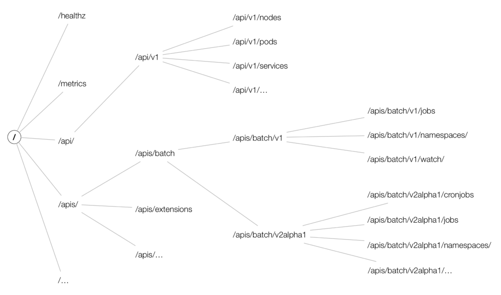

# Interaction with API server

## API

The API server is the only component that talks directly with the distributed storage component (etcd).

API server core responsibilities:

- serve the Kubernetes API (cluster-internally and externally)
  - this means:
    - reading state: getting single objects, listing them, and streaming changes
    - manipulating state: creating, updating, and deleting objects
- proxy cluster components (such as the Kubernetes dashboard, stream logs, service ports, or serve kubectl exec sessions)


The API server exposes:

- RESTful HTTP API with JSON or 
- protocol buffer  (mainly for cluster-internal communication)


### Verbs

- HTTP GET verb is used for retrieving the data
- HTTP POST verb is used for creating a resource
- HTTP PUT verb is used for updating an existing resource
- HTTP PATCH verb is used for partial updates of existing resources
- HTTP DELETE verb is used for destroying a resource in a nonrecoverable manner


### API terminology

**Kind**: type of an entity.
Each object has a field Kind (lowercase kind in JSON, capitalized Kind in Golang)

**API group**: a collection of `Kind`s that are logically related.

**Resource**: (lowercase, plural word e.g., pods) a set of HTTP endpoints (paths) exposing the CRUD (create, read, update, delete) related to a certain object type in the system.

**GroupVersionResource (or GVR)**: API group + version + Resource. Uniquely defines an HTTP path, like:

**/apis/batch/v1/namespaces/namespace_name/jobs**

**/apis/GROUP/VERSION/namespaces/namespace_name/RESOURCE**

Note: cluster wide resources (ex node), doesn't have the namespace_name


from: [https://cloud.redhat.com/blog/kubernetes-deep-dive-api-server-part-1](https://cloud.redhat.com/blog/kubernetes-deep-dive-api-server-part-1)




### kubectl vs curl example

```bash 
curl --request GET   --url http://localhost:8080/apis/apps/v1/namespaces/example/deployments/authentication

kubectl -n example get deploy/authentication -o=yaml

```


### stability and support

- *Alpha* level (e.g., `v1alpha1`)  disabled by default; support may be dropped at any time
- *Beta* level (e.g., `v2beta3`) enabled by default, well tested but the semantics may change
- *Stable* (generally available, or GA) level (e.g., `v1`) stable


### watches

The API server supports watches: you can add a ?watch=true to certain requests and the API server changes into a watch modus.

### supported resources and supported versions

supported resources: ``` kubectl api-resources```

supported versions: ```kubectl api-versions ```


## Connection to the API server

### kubectl proxy + curl

Proxy the Kubernetes API to our local machine and handle authentication and authorization:

```bash
kubectl proxy --port=8080
```

then:

```bash
curl http://127.0.0.1:8080/apis/batch/v1
```


### kubectl proxy + kubectl --raw

Proxy the Kubernetes API to our local machine and handle authentication and authorization:

```bash
kubectl proxy --port=8080
```

then:

```bash
kubectl get --raw /apis/batch/v1
```


### Clients in differents languages

[https://github.com/kubernetes-client](https://github.com/kubernetes-client)


## The Client Library

## client-go

The Kubernetes programming interface in Go mainly consists of the k8s.io/client-go library, part of Kubernetes.

code from [https://github.com/kubernetes/client-go](https://github.com/kubernetes/client-go)

```bash
go get k8s.io/client-go@latest
```


Most of your code needed to speaks to Kubernetes APIs will use tools/clientcmd/.

### Kubernetes API Types

`client-go` holds the client interfaces. The Kubernetes API Go types for objects like pods, services, and deployments are located in https://github.com/kubernetes/api

To access by Go code: `k8s.io/api`

### API Machinery

https://github.com/kubernetes/apimachinery is another repo to 

To access by Go code: `k8s.io/apimachinery`

It includes all the generic building blocks to implement a Kubernetes-like API.


### Versioning and Compatibility

Clients are hardcoded to a version, and the application developer has to select the right API group version


## Programming Kubernetes

Kubernetes objects fulfill a Go interface called `runtime.Object` from the package *k8s.io/apimachinery/pkg/runtime*:

```go
type Object interface {
    GetObjectKind() schema.ObjectKind
    DeepCopyObject() Object
}
```

`schema.ObjectKind` comes from the *k8s.io/apimachinery/pkg/runtime/schema* package:

```go
type ObjectKind interface {
    SetGroupVersionKind(kind GroupVersionKind)
    GroupVersionKind() GroupVersionKind
}
```

To summarize, a Kubernetes object in Go is a data structure that can:

- Return and set the GroupVersionKind
- Be deep-copied (allow cloning)


on-going ...
