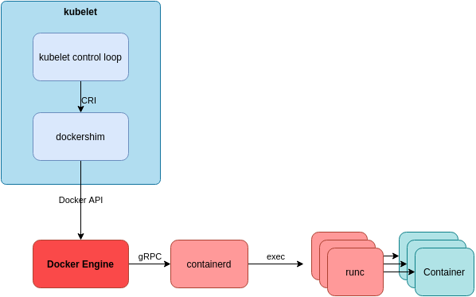

# Kubernetes and Container Runtime

Kubernetes is a container orchestrator but, it does not know how to create, start, and stop containers: it delegates these operations to a pluggable component called the *container runtime* (this is an example of the dependency inversion principle).

Kubernetes, and more specifically, the kubelet, works together with the container runtime to run containers.

## Choosing a Runtime

If you are using a Kubernetes distribution or a managed Kubernetes service, the container runtime will most likely be chosen for you.

The Docker daemon is too heavy and has too many features for the purposes of Kubernetes and containers is the most common chose solution.

## Docker

As  Docker Engine does not implement the CRI, Kubernetes supports the Docker Engine through a CRI [shim](https://en.wikipedia.org/wiki/Shim_(computing)) called the dockershim.

It is built into the kubelet. Essentially, it is a gRPC server that implements the CRI services, acting as a facade between kubelet and the docker runtime.



Notes:

- docker leverages **containerd** under the hood
- **runc** is a low-level container runtime that implements the OCI runtime specification

The containers ends up under containerd, example:

```
systemd
  └─containerd
      └─containerd-shim -namespace moby -workdir ...
          └─nginx
              └─nginx
```

Note: 'moby' is the containerd namespace used by docker engine

Docker CLI can be used to interact with containers on the host.
Containerd CLI to do the same job: you can use ctr or crictl: a cli tool developed by kubernetes community to interact directly with the dockershim on the Unic socket.


## containerd

The containerd container runtime implements the CRI (through the containerd CRI plug-in), so kubelet can connect directly by CRI

Here an example of process tree:

```
systemd
  └─containerd
      └─containerd-shim -namespace k8s.io -workdir ...
          └─nginx
              └─nginx
```

Containerd CLI (ctr) can be used to interact with containers on the host. The containerd namespace is k8s.io.


## CRI-O

CRI-O is a container runtime specifically designed for Kubernetes, and not used outside it.

It **implements the CR**I so kubelet can connect directly by CRI

You can find its usage in Minikube and RedHat OpenShift platform.

Here an example of process tree:

```
systemd
  └─conmon -s -c ed779... -n k8s_nginx_nginx_default_e9115... -u8cdf0c...
      └─nginx
          └─nginx
```

It doesn't have a CLI, but you can use crictl to interact with containers.


## Kata Containers

> Kata Containers is an open source community working to build a secure container runtime with lightweight virtual machines that feel and perform like containers, but provide stronger workload isolation using hardware virtualization technology as a second layer of defense.

They are a good fit for kubernetes for requirements that prevent workloads from sharing a Linux kernel or resource guarantee requirements that cannot be met by cgroup isolation.

They **don't implement  the CRI**: they use containerd and the 'Kata Container containerd shim' to interact with kubelet


It is possible to run Linux container Pods and VM-based Pods on the same node (RuntimeClass, handler and runtimeClassName).


## Virtual Kubelet

> Virtual Kubelet is an open source Kubernetes kubelet implementation that masquerades as a kubelet for the purposes of connecting Kubernetes to other APIs. This allows the nodes to be backed by other services like ACI, AWS Fargate, IoT Edge, Tensile Kube etc.

[https://github.com/virtual-kubelet/virtual-kubelet](https://github.com/virtual-kubelet/virtual-kubelet)

Virtual Kubelet behaves like a kubelet but offers a pluggable API on the backend; backend can be any system that can run an application (example: serveless platform).

Virtual Kubelet community offers a variety of providers including AWS Fargate, Azure Container Instances, HashiCorp Nomad. You can also implement your own provider as well.


