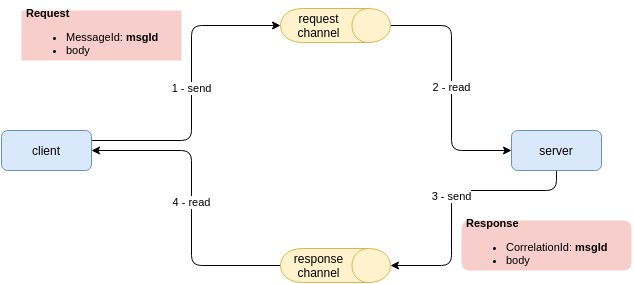
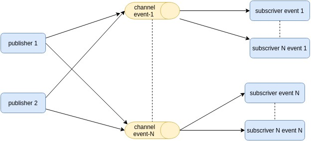

# Interprocess communication for microservice architecture

## Characterization

**Communication can be:**

- one-to-one
- one-to-many

and:

- Synchronous (client waits for answer)
- Asynchronous (client doesn't wait, response can arrive later)

|              | one-to-one                                                   | one-to-many                                    |
| :----------- | :----------------------------------------------------------- | ---------------------------------------------- |
| Synchronous  | Request/response                                             | —                                              |
| Asynchronous | Asynchronous request/response One-way notifications (client doesn't expect a response) | Publish/subscribe Publish/async responses |

**Message formats:**

- text-based
  - examples:
    - [www.w3.org/XML/Schema](http://www.w3.org/XML/Schema)
    - [http://json-schema.org](http://json-schema.org/)
- binary
  - examples:
    - [Protocol Buffers](https://developers.google.com/protocol-buffers/docs/overview)
    - [Avro](https://avro.apache.org)

**Note on availability and synchronous request:**

a synchronous protocol reduce the availability of the application: the availability of a system is the product of the availability of its entities.
To maximize availability: minimize synchronous communication.
One way to achieve it is data replication (a service maintain locally the data it needs): it's a strategy often inefficient (large amount of data, data synchronization, ..)

## Api definition

Regardless the IPC mechanism, it’s important to define a service’s API using some kind of interface definition language (IDL).

Here some points to consider:

- API-first design is essential
- use semantic versioning
- manage backward compatible changes

## IPC and RPC

### REST

It's an IPC that uses HTTP: firewall friendly.

More info: https://www.ics.uci.edu/~fielding/pubs/dissertation/top.htm

Rest Maturity Level: https://martinfowler.com/articles/richardsonMaturityModel.html

Rest Maturity Level in short:

- level 0: use only HTTP POST. Details are inside the body
- level 1: use only HTTP POST but introduce the idea of resources
- level 2:  idea of resources + verb to perform action (GET to retrieve, POST to create, PUT to update); parameter are in the query parameters and body.
- level 3: use HATEOAS (Hypertext As The Engine Of Application State) principle (the GET result provide links to act on the resource)

REST IDL:  the most used is Open API Specification ([www.openapis.org](http://www.openapis.org/))

it’s a synchronous communication mechanism => problem of partial failure => https://microservices.io/patterns/reliability/circuit-breaker.html

#### Some challenges

**retrieve more related resources**

to avoid latency problems: to have them in one response you could use the parameter ?expand=TYPE_OF_NEEDED_RESOURCES

Aleternatives: GraphQL ([http://graphql.org](http://graphql.org/)) and Netflix Falcor (http://netflix.github.io/falcor/).

**As HTTP only provides a limited number of verbs : how map business object to an HTTP verb ?**:

Solution:

- define a subresource (example POST /RESOURCE/RESOURCE_ID/BUSINESS_ACTION) => this is not REST
- specify a business operation as a query parameter => this is not REST
- use another protocol like gRCP!

### gRPC

[https://www.grpc.io/](https://www.grpc.io/)

It's a framework for writing cross language RPC.

It uses HTTP/2 (older firewall could not support it).

Binary Message Protocol => it forces to use a API-first approach by using a Protocol Buffers-based IDL (language-neutral, platform-neutral, extensible mechanism for serializing structured data in a forward-compatible and backward-compatible way)

Protocol Buffer Compiler generate client side stubs and server-side skeletons.

Support of streaming RPC.

Message format: Protocol Buffers. Backward-compatible (new/not recognized fields are skipped).

It’s a synchronous communication mechanism => problem of partial failure => https://microservices.io/patterns/reliability/circuit-breaker.html

## Messaging

The client is written assuming that the reply won’t be received immediately.

Useful links: [https://www.enterpriseintegrationpatterns.com/patterns/messaging/](https://www.enterpriseintegrationpatterns.com/patterns/messaging/)

### Model

Messages are exchanged over message channels. Sender writes messages to a channel. Receiver reads messages from the channel.

Message = header and a message body

Kinds of messages:

- Document
- Command
- Event

Kinds of channels:

- point-to-point: message is received by exactly one of the consumers
- publish-subscribe: message are received by all the attached consumers

### Implementations

#### "request/response" and "asynchronous request/response"

#### "one-way notification"

Client -> channel -> subscriver(s) (withoud a reply).

See previous image. Step 3 and 4 are not made

#### "publish/subscribe"

Messaging adapts properly to publish/subscribe. Message are typically events.

Publish -> channel -> subcriver(s)

Services interested in a particular events has to subscribe to the appropriate channel.

#### "publish/ async response"

Like previous but using a correlation id and reply channel as in the request/response case

### Implementation brokerless

Services exchange directly

#### Benefits

- less impacts on network  (messages go directly)
- broker can be bottleneck or a single point of failure
- simpler infrastructure

#### Drawbacks

- need a discovery mechanisms
- reduced availability (both sender and receiver must be available)
- some mechanisms, such as guaranteed delivery, are more challenging

#### ZeroMQ

Open-source universal messaging library. It provide specification and libraries for different languages

[http://zeromq.org](http://zeromq.org)

### Implementation broker-based

Broker is an intermediary. Accept messages from the sender, and deliver them.

#### Benefits

- discovery mechanisms
- act like a message buffer
- more availability
- Loose coupling
- Flexible communication
- Explicit interprocess communication

#### Drawbacks

- more network impact
- broker can be bottleneck or a single point of failure
- more complex
- Potential performance bottleneck

#### Examples

- ActiveMQ ([http://activemq.apache.org](http://activemq.apache.org/))
- RabbitMQ ([https://www.rabbitmq.com](https://www.rabbitmq.com/))
- Apache Kafka ([http://kafka.apache.org](http://kafka.apache.org/))
- cloud based ones (AWS SQS)

Channel are implemented in different ways.

#### Broker Challenges

**Message ordering**

Even a single broker, multi threaded, have to manage such a problem.

One solution is to use sharded channels (every channel is logically partitioned in shards). A shard key (typically random) is added in the header and used to direct "client -> appropriate shard". The broker or receiver traits all shards as a channel.

**Duplicated messages**

A failure of a client, network, or message broker can result in a message being delivered multiple times.

Guaranteeing exactly-once messaging is usually too costly: at "least once" is the method mostly used.

Solutions:

- Write idempotent message handlers: this is an effort on app side not always possible

- Receiver tracks messages and discard duplicates using message id
