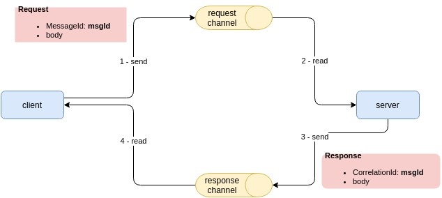
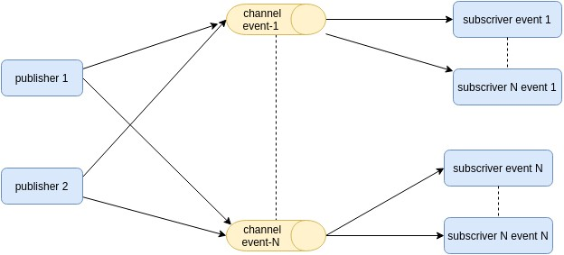

# Interprocess Communication for Microservice Architecture

## Characterization

**Communication can be:**

- One-to-one
- One-to-many

and:

- Synchronous (client waits for answer)
- Asynchronous (client doesn't wait, response can arrive later)

|              | One-to-one                                                   | One-to-many                                    |
| :----------- | :----------------------------------------------------------- | ---------------------------------------------- |
| Synchronous  | Request/response                                             | —                                              |
| Asynchronous | Asynchronous request/response One-way notifications (client doesn't expect a response) | Publish/subscribe Publish/async responses |

**Message formats:**

- Text-based
  - Examples:
    - [www.w3.org/XML/Schema](http://www.w3.org/XML/Schema)
    - [http://json-schema.org](http://json-schema.org/)
- Binary
  - Examples:
    - [Protocol Buffers](https://developers.google.com/protocol-buffers/docs/overview)
    - [Avro](https://avro.apache.org)

**Note on availability and synchronous request:**

A synchronous protocol reduces the availability of the application: the availability of a system is the product of the availability of its entities.
To maximize availability: minimize synchronous communication.
One way to achieve it is data replication (a service maintains locally the data it needs): it's a strategy often inefficient (large amount of data, data synchronization, ...)

## API Definition

Regardless of the IPC mechanism, it's important to define a service's API using some kind of interface definition language (IDL).

Here some points to consider:

- API-first design is essential
- Use semantic versioning
- Manage backward compatible changes

## IPC and RPC

### REST

It's an IPC that uses HTTP: firewall friendly.

More info: https://www.ics.uci.edu/~fielding/pubs/dissertation/top.htm

REST Maturity Level: https://martinfowler.com/articles/richardsonMaturityModel.html

REST Maturity Level in short:

- Level 0: use only HTTP POST. Details are inside the body
- Level 1: use only HTTP POST but introduce the idea of resources
- Level 2: idea of resources + verb to perform action (GET to retrieve, POST to create, PUT to update); parameters are in the query parameters and body.
- Level 3: use HATEOAS (Hypertext As The Engine Of Application State) principle (the GET result provides links to act on the resource)

REST IDL: the most used is Open API Specification ([www.openapis.org](http://www.openapis.org/))

It's a synchronous communication mechanism → problem of partial failure → https://microservices.io/patterns/reliability/circuit-breaker.html

#### Some Challenges

**Retrieve more related resources**

To avoid latency problems: to have them in one response you could use the parameter ?expand=TYPE_OF_NEEDED_RESOURCES

Alternatives: GraphQL ([http://graphql.org](http://graphql.org/)) and Netflix Falcor (http://netflix.github.io/falcor/).

**As HTTP only provides a limited number of verbs: how to map business object to an HTTP verb?**:

Solution:

- Define a subresource (example POST /RESOURCE/RESOURCE_ID/BUSINESS_ACTION) → this is not REST
- Specify a business operation as a query parameter → this is not REST
- Use another protocol like gRPC!

### gRPC

[https://www.grpc.io/](https://www.grpc.io/)

It's a framework for writing cross language RPC.

It uses HTTP/2 (older firewalls could not support it).

Binary Message Protocol → it forces to use an API-first approach by using a Protocol Buffers-based IDL (language-neutral, platform-neutral, extensible mechanism for serializing structured data in a forward-compatible and backward-compatible way)

Protocol Buffer Compiler generates client side stubs and server-side skeletons.

Support of streaming RPC.

Message format: Protocol Buffers. Backward-compatible (new/not recognized fields are skipped).

It's a synchronous communication mechanism → problem of partial failure → https://microservices.io/patterns/reliability/circuit-breaker.html

## Messaging

The client is written assuming that the reply won't be received immediately.

Useful links: [https://www.enterpriseintegrationpatterns.com/patterns/messaging/](https://www.enterpriseintegrationpatterns.com/patterns/messaging/)

### Model

Messages are exchanged over message channels. Sender writes messages to a channel. Receiver reads messages from the channel.

Message = header and a message body

Kinds of messages:

- Document
- Command
- Event

Kinds of channels:

- Point-to-point: message is received by exactly one of the consumers
- Publish-subscribe: messages are received by all the attached consumers

### Implementations

#### "Request/response" and "asynchronous request/response"

#### "One-way notification"

Client → channel → subscriber(s) (without a reply).

See previous image. Step 3 and 4 are not made

#### "Publish/subscribe"

Messaging adapts properly to publish/subscribe. Messages are typically events.

Publish → channel → subscriber(s)

Services interested in a particular event have to subscribe to the appropriate channel.

#### "Publish/async response"

Like previous but using a correlation id and reply channel as in the request/response case

### Implementation Brokerless

Services exchange directly

#### Benefits

- Less impact on network (messages go directly)
- Broker can be bottleneck or a single point of failure
- Simpler infrastructure

#### Drawbacks

- Need a discovery mechanism
- Reduced availability (both sender and receiver must be available)
- Some mechanisms, such as guaranteed delivery, are more challenging

#### ZeroMQ

Open-source universal messaging library. It provides specification and libraries for different languages

[http://zeromq.org](http://zeromq.org)

### Implementation Broker-based

Broker is an intermediary. Accepts messages from the sender, and delivers them.

#### Benefits

- Discovery mechanism
- Acts like a message buffer
- More availability
- Loose coupling
- Flexible communication
- Explicit interprocess communication

#### Drawbacks

- More network impact
- Broker can be bottleneck or a single point of failure
- More complex
- Potential performance bottleneck

#### Examples

- ActiveMQ ([http://activemq.apache.org](http://activemq.apache.org/))
- RabbitMQ ([https://www.rabbitmq.com](https://www.rabbitmq.com/))
- Apache Kafka ([http://kafka.apache.org](http://kafka.apache.org/))
- Cloud based ones (AWS SQS)

Channels are implemented in different ways.

#### Broker Challenges

**Message ordering**

Even a single broker, multi threaded, has to manage such a problem.

One solution is to use sharded channels (every channel is logically partitioned in shards). A shard key (typically random) is added in the header and used to direct "client → appropriate shard". The broker or receiver treats all shards as a channel.

**Duplicated messages**

A failure of a client, network, or message broker can result in a message being delivered multiple times.

Guaranteeing exactly-once messaging is usually too costly: "at least once" is the method mostly used.

Solutions:

- Write idempotent message handlers: this is an effort on app side not always possible
- Receiver tracks messages and discards duplicates using message id